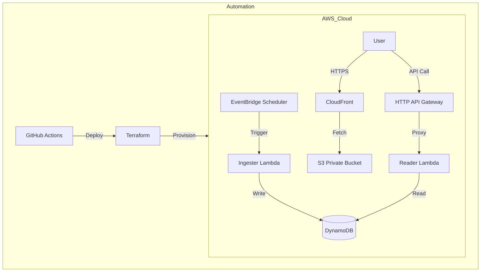

# El Niño 2026: Serverless Lottery Platform
[](https://github.com/NoENoG/el-nino-lottery-aws/actions/workflows/deploy.yml)

A Terraform-managed, event-driven architecture designed for high-concurrency ingestion and distribution of lottery results.


## The Evolution: From Static to Serverless

This project represents the second phase of my cloud journey.

Last December, I built **[El Gordo 2025](https://github.com/NoENoG/el-gordo-lottery-aws)** (my first project). It was a simple static website hosted on S3 that relied on client-side JavaScript and 3rd-party APIs. It solved the user interface problem, but it lacked backend control.

For **El Niño 2026**, I wanted to challenge myself to own the entire stack—from ingestion to API security—and automate the delivery pipeline.

### Technical Comparison

| Feature | El Gordo (Project 1) | El Niño (Project 2) | Engineering Growth |
| :--- | :--- | :--- | :--- |
| **Compute** | Browser (Client-Side) | **AWS Lambda** | Moved logic to the backend to ensure consistent validation and security. |
| **Data Source** | 3rd Party Public API | **Amazon DynamoDB** | Designed my own NoSQL schema to own the data and ensure availability. |
| **Infrastructure** | Manual / Pipeline | **Terraform (IaC)** | Shifted to "Infrastructure as Code" to make the environment reproducible. |
| **Deployment** | Manual Uploads | **GitHub Actions (CI/CD)** | Automated Terraform apply & S3 sync to eliminate human error. |
| **Cost Model** | S3 Hosting | **Event-Driven** | Utilized EventBridge and On-Demand capacity to achieve true scale-to-zero. |


## Architecture

The system utilizes a fully serverless stack to ensure zero idle costs outside of the January 6th draw window.

1.  **Ingestion:** Amazon EventBridge Scheduler triggers the Ingester Lambda (Python).
2.  **Storage:** Amazon DynamoDB (On-Demand Mode) for sub-millisecond write latency.
3.  **API:** AWS HTTP API Gateway with Proxy Integration to the Reader Lambda.
4.  **Distribution:** Amazon S3 (Private) serving static assets via CloudFront (OAC).



## Technology Stack

| Component | Service | Configuration Details |
| :--- | :--- | :--- |
| **IaC** | Terraform | Modular structure, local state management. |
| **CI/CD** | GitHub Actions | Automated pipeline triggers on push to `main`. |
| **Compute** | AWS Lambda | Python 3.12, Boto3 SDK. |
| **Database** | DynamoDB | Partition Key: `DrawDate` (String). Billing: Pay-Per-Request. |
| **Security** | IAM & OAC | Least Privilege Roles, Origin Access Control for S3. |
| **Network** | CloudFront | Global Edge Locations, HTTPS enforcement. |


## 📸 Demo


*Simple, ad-free interface serving live results via API Gateway.*

## Deployment Guide

### Prerequisites
* Terraform v1.5+
* AWS CLI v2
* Python 3.12

### Infrastructure Provisioning

1.  **Initialize Terraform**
    ```bash
    cd infrastructure
    cp terraform.tfvars.example terraform.tfvars
    # Configure 'aws_region' in terraform.tfvars
    terraform init
    ```

2.  **Apply Configuration**
    ```bash
    terraform apply -auto-approve
    ```

### Frontend Deployment

Sync static assets to the output S3 bucket.

```bash
aws s3 sync ../frontend s3://$(terraform output -raw frontend_bucket_name)
```
---

## 👨‍💻 Author

**Mohamed Aly**
*AWS Certified AI Practitioner | Cloud Engineer*

Built with focused intent in Barcelona, Spain.
[LinkedIn](https://www.linkedin.com/in/mohamed-aly-cloud/) | [GitHub](https://github.com/NoENoG)

---
